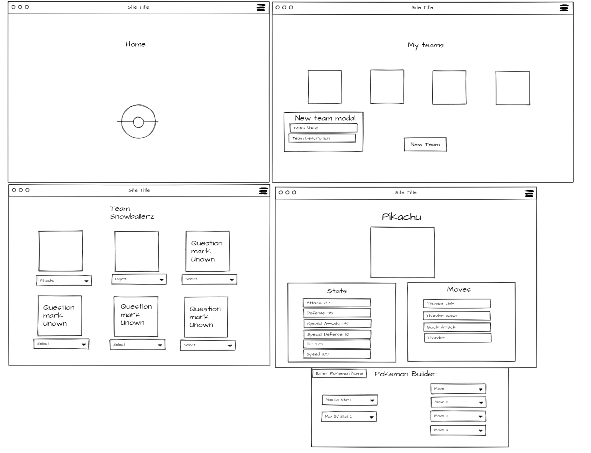

# PokeBuilds.
PokeBuilds is an online pokemon team builder, where you can recreate and share your favorite pokemon teams from your favorite games and look at the teams of players. 

## Motivation
The Pokemon team you collect when playing a Pokemon game is a crucial part of the playthrough and changes the experience everytime you play. What players are looking to accomplish can drastically change what team would be best, when you wanna be the very best. Pokebuilds seeks to fill this niche with a platform for more focused players to save and share great PokemonBuilds for every challenge like speed-running, pvp-battling, and nuzlocking across all the generations and regions. 

## Existing Features
* Create a Pokebuilds Account
* View your created teams
* View most-liked teams
* Create or remove teams
* View information about pokemom

## Screenshots
.png)
.png)
.png)

## User Stories
* User wants to create an account.
* User wants to view teams.
* User wants to view team information.
* User wants to create a team, with customizable Pokemon.
* User wants to edit/delete their teams.

## WireFrames

## ERD

## Technologies
* Express.js
* Node.js
* MaterialUI
* PostGreSQL
* React Hooks
* Javascript
* jQuery
* CSS
* HTML

## Code Snippets
[Ted's Snippets](images/unknown.png)
[Nile's Snippets](images/structure.PNG)
[Nick's Snippets](images/Screen_Shot_2020-11-30_at_11.27.54_AM.png)

## Planned Features
* Search function for pokemon.
* Retrieve teams from a user search.
* Search for Teams by game (region locked)
* Customizable stats(EV's)
* Liking or sharing other user's teams